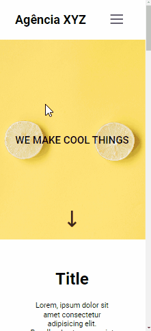

<h1 align="center"> Landing Page </h1>

<h2 align="center">Landing page created class using HTML and CSS.</h2>

 

Desktop image:

Mobile image:

---
## 💻**How was it done?**
This project was made using CSS FlexBox, CSS Grid and CSS Animation techniques.

  

### 🎨 **Project Colors**:
- Background-colors: About `#fff` | Services `#add8e6` `#ffb6c1` | Footer `#90ee90`
- Text-colors:  `#fff` `#000`
- Buttons: `#ff7f50` 

  

### ⚡ Access the [project online](https://laisbagno.github.io/landing-page/)

---
### 💎 Follow me on [linkedin](https://www.linkedin.com/in/laisbagno/)
